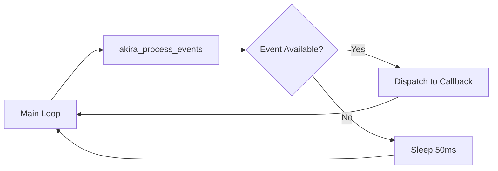

# 🚀 AKIRA SDK API Documentation

> **The Ultimate Guide to Building WASM Applications for AkiraOS**

[](https://github.com/akiraos/sdk)
[](LICENSE)
[](https://webassembly.org/)

---

## 📚 Table of Contents

- [Overview](#-overview)
- [Quick Start](#-quick-start)
- [Core Concepts](#-core-concepts)
- [API Reference](#-api-reference)
  - [Event System](#-event-system)
  - [Display API](#-display-api)
  - [Input API](#-input-api)
  - [RF Communication](#-rf-communication)
  - [Sensor API](#-sensor-api)
  - [Storage API](#-storage-api)
  - [Network API](#-network-api)
  - [System API](#-system-api)
- [Best Practices](#-best-practices)
- [Troubleshooting](#-troubleshooting)
- [Examples](#-examples)

---

## 🌟 Overview

The **AKIRA SDK** provides a comprehensive C API for building WebAssembly applications that run on AkiraOS-powered embedded devices. Whether you're building IoT applications, sensor networks, or interactive displays, AKIRA SDK has you covered!

### ✨ Key Features

- 🎯 **Event-Driven Architecture** - Efficient callback-based event handling
- 🖥️ **Display Support** - RGB565 graphics with text and primitives
- 🎮 **Input Handling** - Button and sensor input management
- 📡 **RF Communication** - Support for multiple RF chips (nRF24, LoRa, etc.)
- 💾 **Storage API** - Persistent file-based storage
- 🌐 **Network APIs** - HTTP and MQTT connectivity
- 📊 **Sensor Integration** - IMU, environmental, and power sensors
- ⚡ **Low Overhead** - Optimized for embedded systems

---

## 🚀 Quick Start

### Your First AKIRA App

```c
#include "akira_api.h"

void my_timer_callback(void) {
    akira_display_clear(0x001F);  // Clear to blue
    akira_display_text(10, 10, "Hello AKIRA!", 0xFFFF);
    akira_display_flush();
}

AKIRA_APP_MAIN() {
    // Register a 1-second timer
    akira_register_timer_callback(0, my_timer_callback);
    
    // Main event loop
    while(1) {
        akira_process_events();
    }
    
    return 0;
}
```

### 📦 Required Capabilities

Add to your `manifest.json`:

```json
{
  "name": "hello-akira",
  "capabilities": [
    "display.write",
    "system.info"
  ]
}
```

---

## 💡 Core Concepts

### 🔄 Event Processing Model

AKIRA uses an event-driven architecture. Your application must:

1. **Register callbacks** for events you care about
2. **Call `akira_process_events()`** regularly in your main loop
3. **Handle events** in your callback functions



### 📊 Resource Limits

| Resource | Limit | Constant |
|----------|-------|----------|
| Timers | 16 | `AKIRA_MAX_TIMERS` |
| Callbacks | 64 | `AKIRA_MAX_CALLBACKS` |
| Topic Length | 128 bytes | `AKIRA_MAX_TOPIC_LEN` |
| Payload Size | 128 bytes | `AKIRA_MAX_PAYLOAD_LEN` |
| GPIO Ports | 8 | `AKIRA_MAX_GPIO_PORTS` |
| Pins per Port | 32 | `AKIRA_MAX_GPIO_PINS_PER_PORT` |

---

## 📖 API Reference

### ⚡ Event System

#### Event Types

```c
typedef enum {
    AKIRA_EVENT_TYPE_TIMER,    // Timer fired
    AKIRA_EVENT_TYPE_GPIO,     // GPIO state changed
    AKIRA_EVENT_TYPE_MESSAGE   // Message received
} akira_event_type_t;
```

#### Core Event Functions

##### `akira_process_events()`

**Process pending events from the runtime.**

```c
void akira_process_events(void);
```

**📌 Important Notes:**
- ⚠️ **Must be called regularly** in your main loop
- Processes up to 5 events per call to prevent starvation
- Sleeps 50ms when no events are available
- Non-blocking operation

**Example:**
```c
while(1) {
    akira_process_events();
    // Your application logic here
}
```

---

### ⏰ Timer Callbacks

#### `akira_register_timer_callback()`

**Register a callback for timer events.**

```c
int akira_register_timer_callback(int timer_id, timer_callback_func_t callback);
```

**Parameters:**
- `timer_id` - Timer ID (0-15)
- `callback` - Function to call when timer fires

**Returns:**
- `0` on success
- `-EINVAL` if parameters are invalid

**Example:**
```c
void every_second(void) {
    static int count = 0;
    printf("Tick %d\n", count++);
}

akira_register_timer_callback(0, every_second);
```

#### `akira_unregister_timer_callback()`

**Unregister a timer callback.**

```c
int akira_unregister_timer_callback(int timer_id);
```

**Returns:**
- `0` on success
- `-EINVAL` if timer_id is invalid
- `-ENOENT` if no callback was registered

---

### 📍 GPIO Callbacks

#### `akira_register_gpio_callback()`

**Register a callback for GPIO pin state changes.**

```c
int akira_register_gpio_callback(gpio_callback_func_t callback, int port, int pin);
```

**Parameters:**
- `callback` - Function to call on state change
- `port` - Port number (0-7)
- `pin` - Pin number (0-31)

**Callback Signature:**
```c
typedef void (*gpio_callback_func_t)(uint8_t state);
```

**Example:**
```c
void button_handler(uint8_t state) {
    if (state == 1) {
        printf("Button pressed!\n");
    } else {
        printf("Button released!\n");
    }
}

akira_register_gpio_callback(button_handler, 0, 5);  // Port 0, Pin 5
```

#### `akira_unregister_gpio_callback()`

**Unregister a GPIO callback.**

```c
int akira_unregister_gpio_callback(int port, int pin);
```

---

### 💬 Message Callbacks

#### `akira_register_message_callback()`

**Subscribe to messages on a specific topic.**

```c
int akira_register_message_callback(message_callback_func_t callback, const char *topic);
```

**Callback Signature:**
```c
typedef void (*message_callback_func_t)(
    const char *topic,
    const char *content_type,
    const void *payload,
    uint32_t payload_len
);
```

**Example:**
```c
void sensor_data_handler(const char *topic, const char *content_type,
                        const void *payload, uint32_t payload_len) {
    printf("Received %u bytes on topic '%s'\n", payload_len, topic);
    printf("Content-Type: %s\n", content_type);
    
    // Process payload...
}

akira_register_message_callback(sensor_data_handler, "sensors/temperature");
```

#### `akira_unregister_message_callback()`

**Unsubscribe from a topic.**

```c
int akira_unregister_message_callback(const char *topic);
```

---

### 🖥️ Display API

> **Required Capability:** `display.write`

#### Color Format

AKIRA displays use **RGB565** format:
- 5 bits Red (bits 11-15)
- 6 bits Green (bits 5-10)
- 5 bits Blue (bits 0-4)

**Common Colors:**
```c
#define COLOR_BLACK   0x0000
#define COLOR_WHITE   0xFFFF
#define COLOR_RED     0xF800
#define COLOR_GREEN   0x07E0
#define COLOR_BLUE    0x001F
#define COLOR_YELLOW  0xFFE0
#define COLOR_CYAN    0x07FF
#define COLOR_MAGENTA 0xF81F
```

#### Display Functions

##### `akira_display_clear()`

**Clear the entire display with a solid color.**

```c
void akira_display_clear(uint16_t color);
```

##### `akira_display_pixel()`

**Draw a single pixel.**

```c
void akira_display_pixel(int x, int y, uint16_t color);
```

##### `akira_display_rect()`

**Draw a filled rectangle.**

```c
void akira_display_rect(int x, int y, int w, int h, uint16_t color);
```

##### `akira_display_text()`

**Draw text on the display.**

```c
void akira_display_text(int x, int y, const char *text, uint16_t color);
```

##### `akira_display_flush()`

**⚠️ Important: Flush the framebuffer to the display.**

```c
void akira_display_flush(void);
```

All drawing operations are buffered. You **must** call `flush()` to see changes!

##### `akira_display_get_size()`

**Get display dimensions.**

```c
void akira_display_get_size(int *width, int *height);
```

#### Display Example

```c
int width, height;
akira_display_get_size(&width, &height);

// Clear to black
akira_display_clear(COLOR_BLACK);

// Draw a red rectangle
akira_display_rect(10, 10, 100, 50, COLOR_RED);

// Draw white text
akira_display_text(20, 25, "AKIRA SDK", COLOR_WHITE);

// Don't forget to flush!
akira_display_flush();
```

---

### 🎮 Input API

> **Required Capability:** `input.read`

#### Button Constants

```c
#define AKIRA_BTN_POWER     (1 << 0)
#define AKIRA_BTN_SETTINGS  (1 << 1)
#define AKIRA_BTN_UP        (1 << 2)
#define AKIRA_BTN_DOWN      (1 << 3)
#define AKIRA_BTN_LEFT      (1 << 4)
#define AKIRA_BTN_RIGHT     (1 << 5)
#define AKIRA_BTN_A         (1 << 6)
#define AKIRA_BTN_B         (1 << 7)
#define AKIRA_BTN_X         (1 << 8)
#define AKIRA_BTN_Y         (1 << 9)
```

#### Input Functions

##### `akira_input_read_buttons()`

**Read current button state as bitmask.**

```c
uint32_t akira_input_read_buttons(void);
```

##### `akira_input_button_pressed()`

**Check if a specific button is pressed.**

```c
bool akira_input_button_pressed(uint32_t button);
```

##### `akira_input_set_callback()`

**Set callback for button events.**

```c
typedef void (*akira_input_callback_t)(uint32_t buttons);
void akira_input_set_callback(akira_input_callback_t callback);
```

#### Input Example

```c
void handle_input(uint32_t buttons) {
    if (buttons & AKIRA_BTN_A) {
        printf("Button A pressed!\n");
    }
    if (buttons & AKIRA_BTN_B) {
        printf("Button B pressed!\n");
    }
}

akira_input_set_callback(handle_input);

// Or poll directly
uint32_t buttons = akira_input_read_buttons();
if (buttons & AKIRA_BTN_UP) {
    // Handle up button
}
```

---

### 📡 RF Communication

> **Required Capability:** `rf.transceive`

#### Supported RF Chips

```c
#define AKIRA_RF_CHIP_NONE      0
#define AKIRA_RF_CHIP_NRF24L01  1  // 2.4GHz
#define AKIRA_RF_CHIP_LR1121    2  // LoRa
#define AKIRA_RF_CHIP_CC1101    3  // Sub-GHz
#define AKIRA_RF_CHIP_SX1276    4  // LoRa
#define AKIRA_RF_CHIP_RFM69     5  // FSK/OOK
```

#### RF Modes

```c
#define AKIRA_RF_MODE_IDLE   0
#define AKIRA_RF_MODE_RX     1  // Receive
#define AKIRA_RF_MODE_TX     2  // Transmit
#define AKIRA_RF_MODE_SLEEP  3
```

#### RF Functions

##### `akira_rf_init()`

```c
int akira_rf_init(akira_rf_chip_t chip);
```

##### `akira_rf_send()`

```c
int akira_rf_send(const uint8_t *data, size_t len);
```

##### `akira_rf_receive()`

```c
int akira_rf_receive(uint8_t *buffer, size_t max_len, uint32_t timeout_ms);
```

##### `akira_rf_set_frequency()`

```c
int akira_rf_set_frequency(uint32_t freq_hz);
```

##### `akira_rf_set_power()`

```c
int akira_rf_set_power(int8_t dbm);
```

##### `akira_rf_get_rssi()`

```c
int akira_rf_get_rssi(int16_t *rssi);
```

#### RF Example

```c
// Initialize nRF24L01
akira_rf_init(AKIRA_RF_CHIP_NRF24L01);

// Set frequency to 2.450 GHz
akira_rf_set_frequency(2450000000);

// Set TX power to 0 dBm
akira_rf_set_power(0);

// Send data
uint8_t data[] = "Hello RF!";
akira_rf_send(data, sizeof(data));

// Receive with 1 second timeout
uint8_t buffer[64];
int received = akira_rf_receive(buffer, sizeof(buffer), 1000);
if (received > 0) {
    printf("Received %d bytes\n", received);
}

// Get signal strength
int16_t rssi;
akira_rf_get_rssi(&rssi);
printf("RSSI: %d dBm\n", rssi);
```

---

### 🌡️ Sensor API

> **Required Capability:** `sensor.<type>.read`

#### Sensor Types

```c
typedef enum {
    SENSOR_TYPE_NONE = 0,
    SENSOR_TYPE_ACCEL,      // Accelerometer
    SENSOR_TYPE_GYRO,       // Gyroscope
    SENSOR_TYPE_TEMP,       // Temperature
    SENSOR_TYPE_HUMIDITY,   // Humidity
    SENSOR_TYPE_PRESSURE,   // Barometric pressure
    SENSOR_TYPE_LIGHT,      // Light/Lux
    SENSOR_TYPE_VOLTAGE,    // Battery voltage
    SENSOR_TYPE_CURRENT,    // Current draw
    SENSOR_TYPE_POWER       // Power consumption
} akira_sensor_type_t;
```

#### Sensor Data Structures

```c
typedef struct {
    float accel_x, accel_y, accel_z;
    float gyro_x, gyro_y, gyro_z;
} akira_imu_data_t;

typedef struct {
    float temperature;  // °C
    float humidity;     // %RH
    float pressure;     // hPa
} akira_env_data_t;

typedef struct {
    float voltage;      // V
    float current;      // A
    float power;        // W
} akira_power_data_t;
```

#### Sensor Functions

##### `akira_sensor_read()`

**Read a single sensor value.**

```c
int akira_sensor_read(akira_sensor_type_t type, float *value);
```

##### `akira_sensor_read_imu()`

**Read IMU data (accelerometer + gyroscope).**

```c
int akira_sensor_read_imu(akira_imu_data_t *data);
```

##### `akira_sensor_read_env()`

**Read environmental sensors.**

```c
int akira_sensor_read_env(akira_env_data_t *data);
```

##### `akira_sensor_read_power()`

**Read power measurements.**

```c
int akira_sensor_read_power(akira_power_data_t *data);
```

#### Sensor Example

```c
// Read single sensor
float temp;
if (akira_sensor_read(SENSOR_TYPE_TEMP, &temp) == 0) {
    printf("Temperature: %.1f°C\n", temp);
}

// Read IMU
akira_imu_data_t imu;
if (akira_sensor_read_imu(&imu) == 0) {
    printf("Accel: %.2f, %.2f, %.2f g\n", 
           imu.accel_x, imu.accel_y, imu.accel_z);
    printf("Gyro: %.2f, %.2f, %.2f °/s\n",
           imu.gyro_x, imu.gyro_y, imu.gyro_z);
}

// Read environmental
akira_env_data_t env;
if (akira_sensor_read_env(&env) == 0) {
    printf("Temp: %.1f°C, Humidity: %.1f%%, Pressure: %.1f hPa\n",
           env.temperature, env.humidity, env.pressure);
}
```

---

### 💾 Storage API

> **Required Capability:** `storage.read` / `storage.write`

#### Storage Functions

##### `akira_storage_read()`

```c
int akira_storage_read(const char *path, void *buffer, size_t len);
```

##### `akira_storage_write()`

```c
int akira_storage_write(const char *path, const void *data, size_t len);
```

##### `akira_storage_delete()`

```c
int akira_storage_delete(const char *path);
```

##### `akira_storage_list()`

```c
int akira_storage_list(const char *path, char **files, int max_count);
```

##### `akira_storage_size()`

```c
int akira_storage_size(const char *path);
```

#### Storage Example

```c
// Write config file
const char *config = "{\"mode\":\"auto\",\"interval\":60}";
akira_storage_write("config.json", config, strlen(config));

// Read it back
char buffer[256];
int bytes = akira_storage_read("config.json", buffer, sizeof(buffer));
if (bytes > 0) {
    buffer[bytes] = '\0';
    printf("Config: %s\n", buffer);
}

// Get file size
int size = akira_storage_size("config.json");
printf("File size: %d bytes\n", size);

// Delete file
akira_storage_delete("config.json");
```

---

### 🌐 Network API

> **Required Capability:** `network.http` / `network.mqtt`

#### HTTP Functions

##### `akira_http_get()`

```c
int akira_http_get(const char *url, uint8_t *buffer, size_t max_len);
```

##### `akira_http_post()`

```c
int akira_http_post(const char *url, const uint8_t *data, size_t len);
```

#### MQTT Functions

##### `akira_mqtt_publish()`

```c
int akira_mqtt_publish(const char *topic, const void *data, size_t len);
```

##### `akira_mqtt_subscribe()`

```c
typedef void (*akira_mqtt_callback_t)(const char *topic, const void *data, size_t len);
int akira_mqtt_subscribe(const char *topic, akira_mqtt_callback_t callback);
```

#### Network Example

```c
// HTTP GET
uint8_t response[1024];
int len = akira_http_get("https://api.example.com/status", response, sizeof(response));
if (len > 0) {
    printf("Response: %.*s\n", len, response);
}

// HTTP POST
const char *json = "{\"sensor\":\"temp\",\"value\":23.5}";
int status = akira_http_post("https://api.example.com/data", 
                             (uint8_t*)json, strlen(json));
printf("Status code: %d\n", status);

// MQTT
void mqtt_handler(const char *topic, const void *data, size_t len) {
    printf("MQTT: %s -> %.*s\n", topic, (int)len, (char*)data);
}

akira_mqtt_subscribe("sensors/#", mqtt_handler);
akira_mqtt_publish("sensors/temp", "23.5", 4);
```

---

### ⚙️ System API

> **Required Capability:** `system.info`

#### System Functions

##### `akira_system_uptime_ms()`

**Get system uptime in milliseconds.**

```c
uint64_t akira_system_uptime_ms(void);
```

##### `akira_system_free_memory()`

**Get free heap memory in bytes.**

```c
size_t akira_system_free_memory(void);
```

##### `akira_system_platform()`

**Get platform name.**

```c
const char *akira_system_platform(void);
```

##### `akira_system_sleep()`

**Sleep for specified milliseconds.**

```c
void akira_system_sleep(uint32_t ms);
```

##### `akira_log()`

**Log a message for debugging.**

```c
void akira_log(int level, const char *message);
```

**Log Levels:**
- `0` - Error
- `1` - Warning
- `2` - Info
- `3` - Debug

#### System Example

```c
printf("Platform: %s\n", akira_system_platform());
printf("Uptime: %llu ms\n", akira_system_uptime_ms());
printf("Free memory: %zu bytes\n", akira_system_free_memory());

akira_log(2, "Application started");
akira_system_sleep(1000);  // Sleep 1 second
```

---

## ✅ Best Practices

### 🎯 Event Loop Design

```c
AKIRA_APP_MAIN() {
    // Initialize
    setup_callbacks();
    init_peripherals();
    
    // Main loop
    while(1) {
        // Process all pending events
        akira_process_events();
        
        // Your application logic
        update_state();
        
        // Don't hog the CPU!
        // Events system handles sleeping
    }
    
    return 0;
}
```

### 🔒 Memory Safety

- Always null-terminate strings
- Check buffer sizes before copying
- Validate callback parameters
- Use `strncpy` with explicit null termination:

```c
char buffer[128];
strncpy(buffer, input, sizeof(buffer) - 1);
buffer[sizeof(buffer) - 1] = '\0';  // ✅ Always do this!
```

### ⚡ Performance Tips

1. **Batch Display Updates**
   ```c
   akira_display_clear(COLOR_BLACK);
   akira_display_rect(0, 0, 100, 100, COLOR_RED);
   akira_display_text(10, 10, "Status", COLOR_WHITE);
   akira_display_flush();  // One flush for all updates
   ```

2. **Minimize Event Processing**
   - Unregister callbacks you don't need
   - Keep callback functions fast
   - Avoid blocking operations in callbacks

3. **Efficient Message Handling**
   ```c
   // ✅ Good: Process small messages quickly
   void msg_handler(const char *topic, const char *content_type,
                   const void *payload, uint32_t len) {
       if (len <= 4) {
           uint32_t value = *(uint32_t*)payload;
           process_value(value);
       }
   }
   
   // ❌ Bad: Heavy processing blocks other events
   void bad_handler(const char *topic, const char *content_type,
                    const void *payload, uint32_t len) {
       parse_complex_json(payload, len);  // Too slow!
       do_expensive_calculation();
   }
   ```

### 🛡️ Error Handling

```c
int result = akira_register_timer_callback(0, my_callback);
if (result != 0) {
    akira_log(0, "Failed to register timer callback");
    return -1;
}

float temp;
if (akira_sensor_read(SENSOR_TYPE_TEMP, &temp) == 0) {
    // Success
    printf("Temperature: %.1f°C\n", temp);
} else {
    // Error
    akira_log(1, "Failed to read temperature sensor");
}
```

---

## 🔧 Troubleshooting

### Common Issues

#### ❌ Display Not Updating

**Problem:** Drawing operations don't appear on screen.

**Solution:** Always call `akira_display_flush()` after drawing!

```c
akira_display_text(0, 0, "Hello", COLOR_WHITE);
akira_display_flush();  // ← Don't forget this!
```

#### ❌ Callback Never Fires

**Problem:** Registered callback is never called.

**Checklist:**
- [ ] Is `akira_process_events()` being called in main loop?
- [ ] Did registration return 0 (success)?
- [ ] Are timer/GPIO/message sources actually generating events?
- [ ] Is callback function signature correct?

#### ❌ Stack Overflow

**Problem:** Application crashes or behaves erratically.

**Causes:**
- Too many local variables in callback functions
- Deep recursion
- Large buffers on stack

**Solution:** Use static or global variables for large buffers:

```c
// ❌ Bad: Large stack allocation
void callback(void) {
    char buffer[4096];  // Too big for stack!
}

// ✅ Good: Static allocation
void callback(void) {
    static char buffer[4096];  // Allocated once
}
```

#### ❌ Memory Leaks

**Problem:** Free memory decreases over time.

**Check:**
- Are you allocating memory without freeing it?
- Are callback registrations accumulating?
- Use `akira_system_free_memory()` to monitor

---

## 💡 Examples

### Complete Example: Temperature Monitor

```c
#include "akira_api.h"
#include <stdio.h>

#define UPDATE_INTERVAL_TIMER 0

static float current_temp = 0.0f;
static int update_count = 0;

void update_display(void) {
    akira_display_clear(0x0000);  // Black
    
    char buffer[64];
    snprintf(buffer, sizeof(buffer), "Temp: %.1fC", current_temp);
    akira_display_text(10, 20, buffer, 0xFFFF);
    
    snprintf(buffer, sizeof(buffer), "Updates: %d", update_count);
    akira_display_text(10, 40, buffer, 0x07E0);  // Green
    
    akira_display_flush();
}

void timer_callback(void) {
    // Read temperature sensor
    if (akira_sensor_read(SENSOR_TYPE_TEMP, &current_temp) == 0) {
        update_count++;
        update_display();
        akira_log(2, "Temperature updated");
    } else {
        akira_log(1, "Failed to read sensor");
    }
}

void button_callback(uint32_t buttons) {
    if (buttons & AKIRA_BTN_A) {
        akira_log(2, "Manual refresh requested");
        timer_callback();  // Force update
    }
}

AKIRA_APP_MAIN() {
    akira_log(2, "Temperature Monitor starting...");
    
    // Register timer (assume 1Hz timer)
    akira_register_timer_callback(UPDATE_INTERVAL_TIMER, timer_callback);
    
    // Register button handler
    akira_input_set_callback(button_callback);
    
    // Initial display
    update_display();
    
    // Main loop
    while(1) {
        akira_process_events();
    }
    
    return 0;
}
```

### Example: MQTT Bridge

```c
#include "akira_api.h"

void sensor_callback(const char *topic, const char *content_type,
                    const void *payload, uint32_t payload_len) {
    // Received sensor data via internal message bus
    // Forward to MQTT
    akira_mqtt_publish(topic, payload, payload_len);
    
    printf("Forwarded %u bytes from %s to MQTT\n", payload_len, topic);
}

AKIRA_APP_MAIN() {
    // Subscribe to local sensor messages
    akira_register_message_callback(sensor_callback, "sensors/temperature");
    akira_register_message_callback(sensor_callback, "sensors/humidity");
    
    while(1) {
        akira_process_events();
    }
    
    return 0;
}
```

### Example: RF Repeater

```c
#include "akira_api.h"

void message_callback(const char *topic, const char *content_type,
                     const void *payload, uint32_t payload_len) {
    // Received message - transmit via RF
    akira_rf_send((const uint8_t*)payload, payload_len);
    printf("Transmitted %u bytes over RF\n", payload_len);
}

void rf_receive_task(void) {
    uint8_t buffer[128];
    int received = akira_rf_receive(buffer, sizeof(buffer), 100);
    
    if (received > 0) {
        // Forward to message bus
        akira_mqtt_publish("rf/received", buffer, received);
        printf("Received %d bytes from RF\n", received);
    }
}

AKIRA_APP_MAIN() {
    akira_rf_init(AKIRA_RF_CHIP_NRF24L01);
    akira_rf_set_frequency(2450000000);
    
    akira_register_message_callback(message_callback, "rf/transmit");
    
    while(1) {
        akira_process_events();
        rf_receive_task();  // Poll for RF data
    }
    
    return 0;
}
```

---

## 📝 Manifest Configuration

### Example manifest.json

```json
{
  "name": "my-app",
  "version": "1.0.0",
  "author": "Your Name",
  "description": "My awesome AKIRA application",
  "capabilities": [
    "display.write",
    "input.read",
    "sensor.temp.read",
    "sensor.humidity.read",
    "storage.read",
    "storage.write",
    "network.http",
    "network.mqtt",
    "rf.transceive",
    "system.info"
  ],
  "memory": {
    "heap": 65536,
    "stack": 8192
  }
}
```

### Capability Reference

| Capability | Description |
|------------|-------------|
| `display.write` | Write to display |
| `input.read` | Read button inputs |
| `sensor.*.read` | Read specific sensor type |
| `storage.read` | Read from storage |
| `storage.write` | Write to storage |
| `network.http` | Make HTTP requests |
| `network.mqtt` | Use MQTT messaging |
| `rf.transceive` | RF communication |
| `system.info` | System information |

---

## 🤝 Contributing

Found a bug? Have a suggestion? We'd love to hear from you!

- 🐛 [Report Issues](https://github.com/akiraos/sdk/issues)
- 💡 [Feature Requests](https://github.com/akiraos/sdk/discussions)
- 📖 [Documentation](https://docs.akiraos.dev)

---

## 📄 License

MIT License - see [LICENSE](LICENSE) for details

---

## 🙏 Acknowledgments

Built with ❤️ by the AkiraOS team

Special thanks to the WebAssembly community and embedded systems developers worldwide!

---

<div align="center">

**Happy Coding! 🚀**

[Documentation](https://docs.akiraos.dev) • [GitHub](https://github.com/akiraos/sdk) • [Discord](https://discord.gg/akiraos)

</div>
